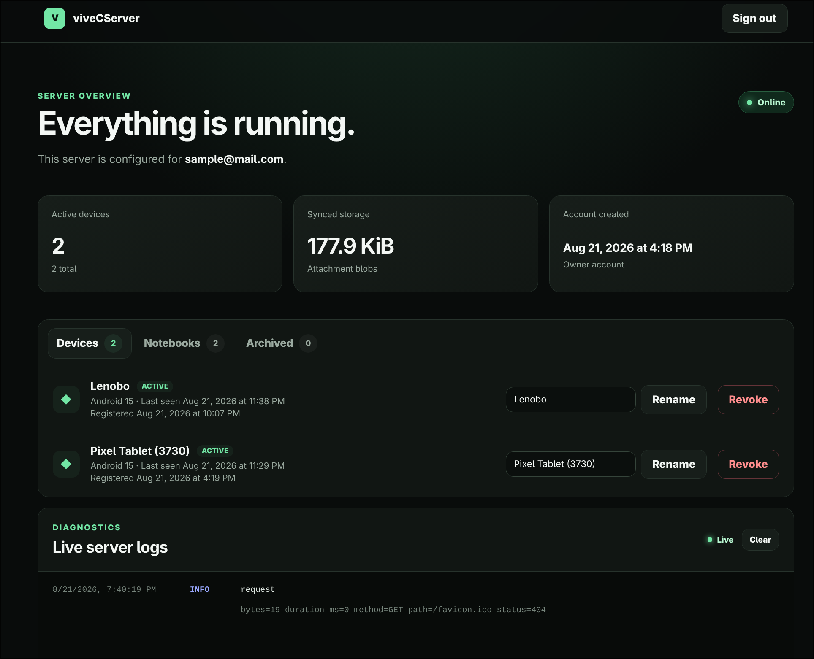

# Vive Notes Community server

The self-hosted sync server for [viveNotes](https://github.com/AquilaIgnis/viveNotes). It is a
small Go service backed by PostgreSQL and distributed as a prebuilt container image.

The server stores, orders, and authorises. It never interprets a note: page documents are opaque
payloads, and everything that needs the document model runs on the client.



# Deploy with docker

Use docs/docker-compose.yml and env sample

- you can use this command for `VIVE_POSTGRES_PASSWORD`

```bash
openssl rand -hex 26
```

Once ready use :

```
docker compose up -d
```

> [!IMPORTANT]
> You have to correct blob directory ownership if it shares parent with the DB

For example:

```bash
 sudo chown -R 1000:1000 ./data/blobs
```

## I lost my password 😱

You will be prompted to enter a new one

```bash
docker compose exec vivecserver /usr/local/bin/vivecserver set-password -email you@example.com
```

# Dev

> Refer to openapi.yml for server - client contract

Local image build

```bash
  docker compose -f deploy/docker-compose.yml -f deploy/docker-compose.dev.yml up --build -d
```

Web interface over: ` http://localhost:8080`

Android emulator: `http://10.0.2.2:5444`
